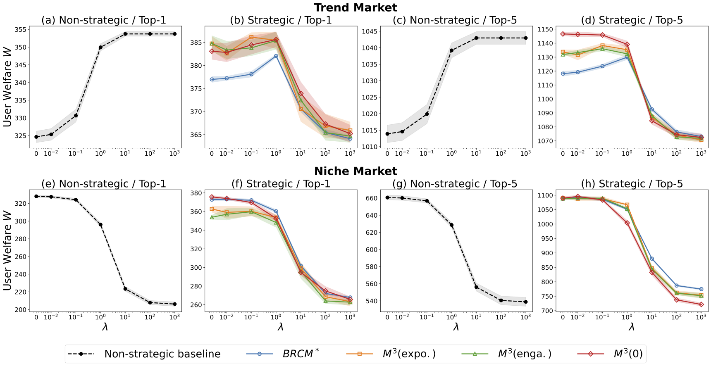
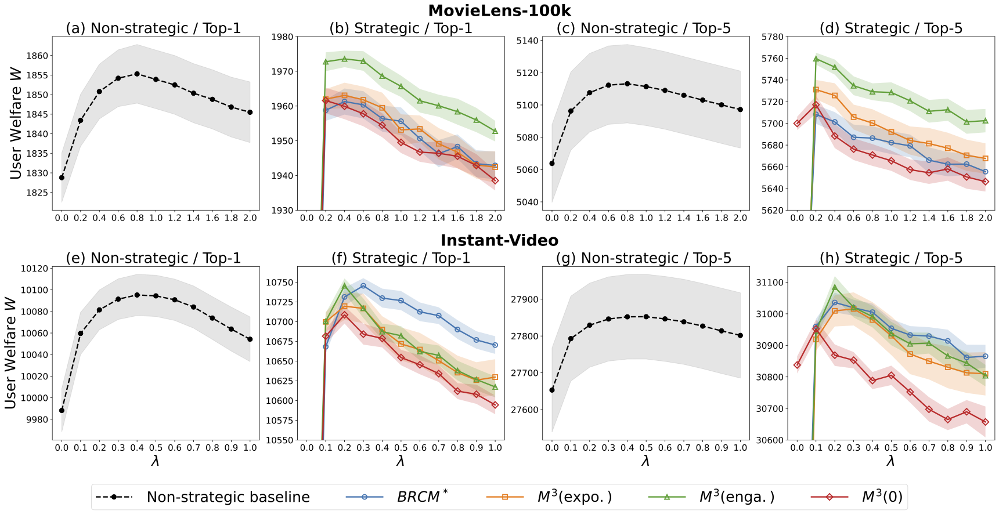

# C3BV

Source code for KDD 2026 paper [Lower Bias, Higher Welfare: How Creator Competition Reshapes Bias-Variance Tradeoff in Recommendation Platforms?](https://arxiv.org/abs/2511.20289).

In this paper, we introduce the **Content Creator Competition with Bias-Variance Tradeoff** ($C^3_{BV}$) framework, a tractable game-theoretic model that captures the platform’s decision on regularization strength in user feature estimation. We derive and compare the platform’s optimal policy under two key settings: a non-strategic baseline with fixed content and a strategic environment where creators compete in response to the platform's algorithmic design.




## Citing C3BV
```
@inproceedings{wang2026lower,
    title={Lower Bias, Higher Welfare: How Creator Competition Reshapes Bias-Variance Tradeoff in Recommendation Platforms?},
    author={Kang Wang and Renzhe Xu and Bo Li},
    booktitle={Proceedings of the 32nd ACM SIGKDD Conference on Knowledge Discovery and Data Mining},
    year={2026}
}
```